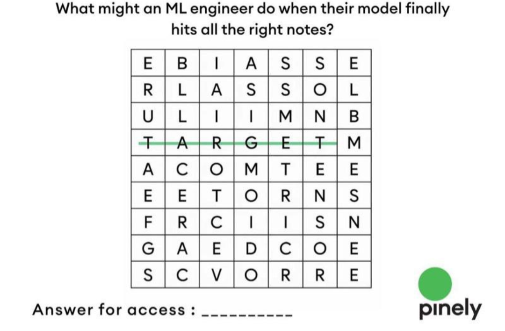
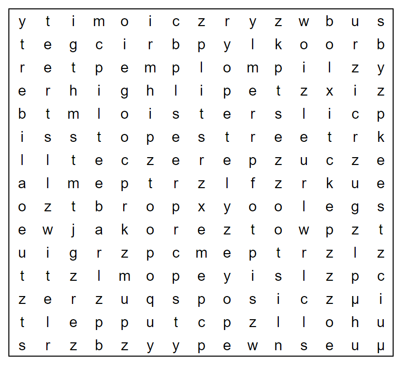

# Can you see it?

Note these style of puzzles require that you "see" something that hints how to solve the puzzle.
Below are puzzles of increasing difficulty. You don't need to solve them, but I want to test 
your ability to "see" hidden messages in the puzzles.

## Puzzle 1

## Puzzle 2
Oh no! The elves in charge of board games only managed to complete a couple of sets before they were distracted by playtesting the toys. Ho-ho-ho-w infuriating!

[The answer to this puzzle is a single word.]

(NOTE-ANDREW: Just try and see if you can start the puzzle and find some hidden clue, message, or instruction in the image.)

## Puzzle 3
The Jane Street Puzzle Master has twenty-three errands (don't worry, almost all of them are tiny!) that she needs to cross off her to-do list (above) on her day off. 

If she can manage that small task, she plans to meet up with some friends tonight for a short while. Can you figure out where they'll meet up, and why?

(NOTE-ANDREW: Again, you don't need to solve the entire puzzle. Just see if you can "see" a hidden clue, message, or instruction in the image.)

