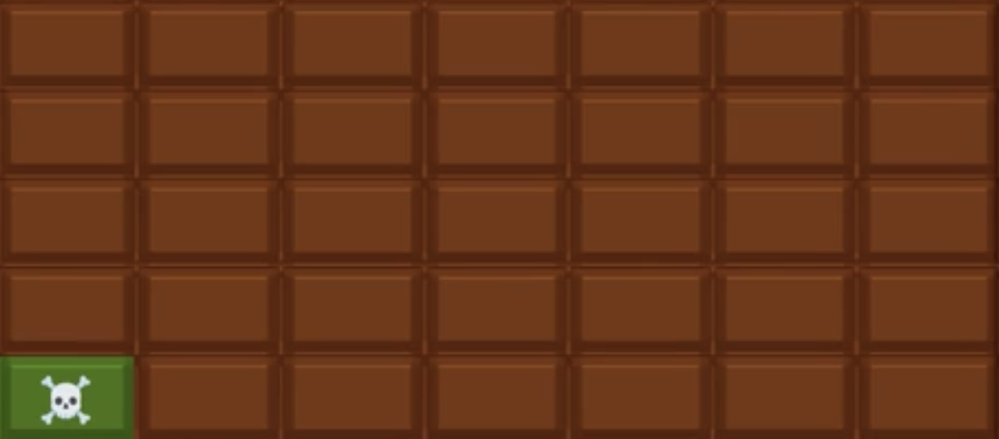

# Combinatorial Games (of no chance)

To wet our appetite we will focus on games of no chance. In other 
words we assume we have perfect informatoin and given all information 
about the game, we can make an optimal choice.

### Problem 1 (The Ramsey Game):

There are two players (Player Blue and Player Red), and there are $6$ points. Player Blue is allowed to pick any two points and draw an edge between the two points blue and similarly for Player Red. A 
player loses if they form a triangle of their color. This means that 
there are three points all connected by the same color edges. 

Player Blue begins the game. Who wins? If it helps here are all the 
edges you can create with only $6$ points. You can color them red or 
blue:

## Tic-Tac-Toe of Colors

### Problem 2 (The Black and White Positions)

We play an ordinary game of tic-tac-toe with the usual rules. This means that a line of $O$'s, a line or $X$'s or if there are no more squares left to fill, then the game ends.

Now we call a position white if there are three $X$'s on one of the
diagonals, and let every other end position be defined to be black.

If the ending position is white then Player $1$ wins, otherwise Player $2$ wins. (Player 1 always starts the game.)

Show that one of the players has a winning strategy.

### Problem 3 (Any Rules for Black and White) 

Suppose that you come up with any rules for what determines of an 
ending position of tic-tac-toe is black or white. Prove that either Player $1$ or Player $2$ must have a winnning strategy.

### Problem 4 (tic-tac-toe is solved)

Although odd, if you completed the above two problems then you can prove that in a standard game of tic-tac-toe, that Player $1$ has 
a strategy that must end either in a win or a draw. But why? How
did we show this without having to consider all the possible games 
of tic-tac-toe?

### Problem 5 (The Game of 18)

Here are the rules for the Game of 18: From a deck of cards extract 
nine cards numbered from $2$ to $10$ and place them face up on a 
table. Each of two players in turn take a card. The player wins who 
first obtains $3$ cards whose sum i sexactly $18$. Player $1$ always 
starts the game. Do they always win?

## Take-Away Games

### Problem 6 (The Game of Chomp)

Alice and Bob take turns biting off pieces of an $m \times n$ 
rectangular chocolate bar marked into unit squares. Each bite 
consists of selecting a square and biting off that square plus 
every remaining square above and/or to the its right. Each player
wishes to avoid getting stuck with the poisonous lower-left square.
Show that, assuming the bar contains more than one square, Alice 
alwyas has a winning strategy.

### Problem 7 (Chips on the Table)

Alice and Bob are are at a table with $21$ chips in its center.
They each take turns removing some number of chips.

During a players turn, they are allowed to take $1$, $2$ or $3$ chips 
at a time. The player that removes the last chip wins. Alice goes first, does she always win?

## Continuous Games (TODO)

