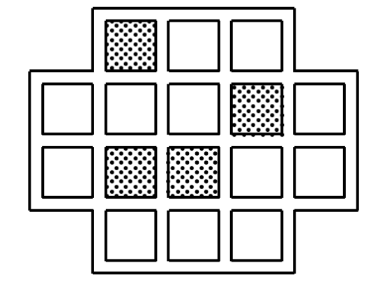

# Brain Teasers

## Matchsticks

### Problem 1:

The figure below shows 9 matchsticks forming an hourglass consisting of two
equilateral triangles. Move 4 matchsticks to turn the hourglass upside down.

### Problem 2:

The figure below shows 10 matchsticks forming an upside down chair. Move 2 
matchsticks to turn the chair right side up.

### Problem 3: 

The figure below shows 5 matchsticks forming a horse. Move 1 stick to make
the horse face a different direction.

## Riddles

### Problem 1: 

A girl put a bookmark in a novel she was reading. She first thought that she 
put it between pages 339 and 340. Then she thought that she put it between
pages 388 and 389. Obviously, she could not be right both times, but she was 
not wrong both times either. Which time was she right first?

### Problem 2:

If it takes four cats to catch four mice in four minutes, how long would it take
forty-eight cats to catch fourty-eight mice?

### Problem 3:

Alice, Brian, Colin, Debra, Edwin and Fiona make the following statements:

|Claims|
|-------------------------------|
|Alice: Only one of us is lying.|
||
|Brian: Exactly two of us is lying.|
||
|Colin: Exactly three of us is lying.|
||
|Debra: Exactly four of us is lying.|
||
|Edwin: Exactly five of us is lying.|
||
|Fiona: All of us are lying.|
||

Who is/are lying?

## Dissections

### Problem 1:

The figure below shows an estate with 4 gardens, which are shaded, along with 
12 buildings. Divide the estate along grid lines into four congruent parts, with
a garden in each.

### Problem 2:

Dissect along grid lines five of the six shapes in the figure below, into 
three consecutive congruent parts each. Which of the one for which this is 
impossible?

### Problem 3:

Dissect the shape below into two congruent parts.

### Problem 4:

